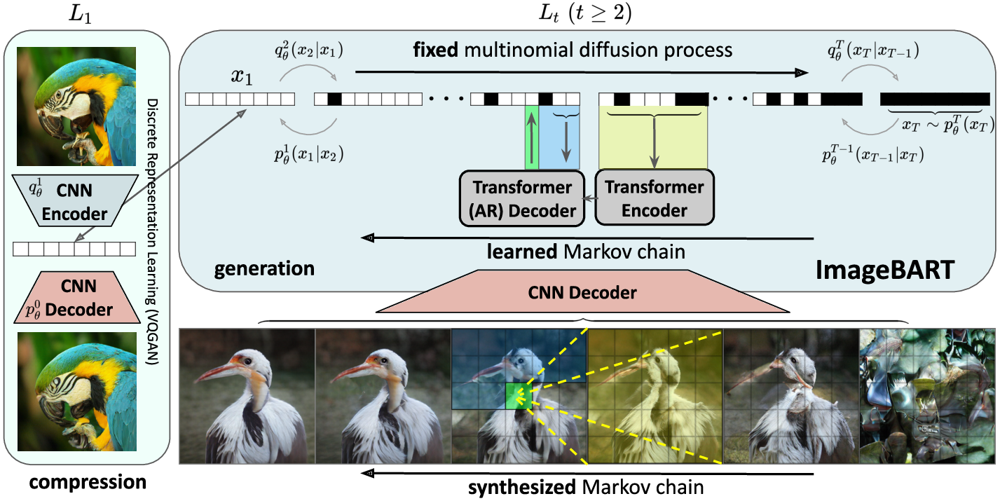
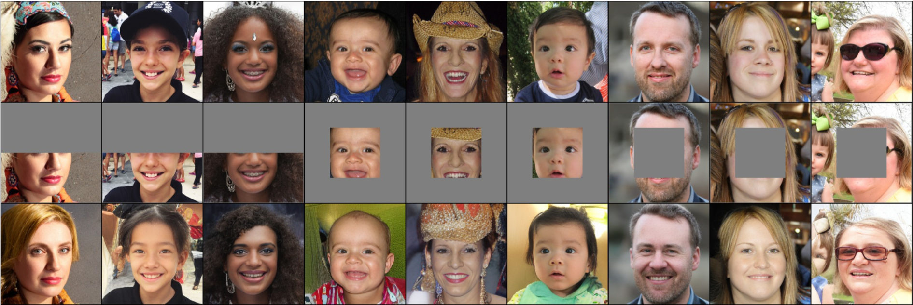
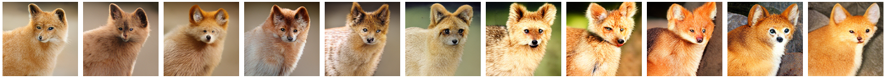

# ImageBART
#### [NeurIPS 2021](https://nips.cc/)


<br/>
[Patrick Esser](https://github.com/pesser)\*,
[Robin Rombach](https://github.com/rromb)\*,
[Andreas Blattmann](https://github.com/ablattmann)\*,
[Björn Ommer](https://ommer-lab.com/)<br/>
\* equal contribution

[arXiv](https://arxiv.org/abs/2108.08827) | [BibTeX](#bibtex) | [Poster](assets/imagebart_poster.pdf) 

## Requirements
A suitable [conda](https://conda.io/) environment named `imagebart` can be created
and activated with:

```
conda env create -f environment.yaml
conda activate imagebart
```

## Get the Models

We provide pretrained weights and hyperparameters for models trained on the following datasets:

* FFHQ: 
    * [4 scales, geometric noise schedule](https://ommer-lab.com/files/ffhq_4_scales_geometric.zip): `wget -c https://ommer-lab.com/files/ffhq_4_scales_geometric.zip`
    * [2 scales, custom noise schedule](https://ommer-lab.com/files/ffhq_2_scales_custom.zip): `wget -c https://ommer-lab.com/files/ffhq_2_scales_custom.zip`
* LSUN, 3 scales, custom noise schedules:
    * [Churches](https://ommer-lab.com/files/churches_3_scales.zip): `wget -c https://ommer-lab.com/files/churches_3_scales.zip`
    * [Bedrooms](https://ommer-lab.com/files/bedrooms_3_scales.zip): `wget -c https://ommer-lab.com/files/bedrooms_3_scales.zip`
    * [Cats](https://ommer-lab.com/files/cats_3_scales.zip): `wget -c https://ommer-lab.com/files/cats_3_scales.zip`
* Class-conditional ImageNet:
    * [5 scales, custom noise schedule](https://ommer-lab.com/files/cin_5_scales_custom.zip): `wget -c https://ommer-lab.com/files/cin_5_scales_custom.zip`
    * [4 scales, geometric noise schedule](https://ommer-lab.com/files/cin_4_scales_geometric.zip): `wget -c https://ommer-lab.com/files/cin_4_scales_geometric.zip`

Download the respective files and extract their contents to a directory `./models/`.

Moreover, we provide all the required VQGANs as a .zip at [https://ommer-lab.com/files/vqgan.zip](https://ommer-lab.com/files/vqgan.zip), 
which contents have to be extracted to `./vqgan/`.    

## Get the Data
Running the training configs or the [inpainting script](scripts/inpaint_imagebart.py) requires 
a dataset available locally. For ImageNet and FFHQ, see this repo's parent directory [taming-transformers](https://github.com/CompVis/taming-transformers).
The LSUN datasets can be conveniently downloaded via the script available [here](https://github.com/fyu/lsun).
We performed a custom split into training and validation images, and provide the corresponding filenames
at [https://ommer-lab.com/files/lsun.zip](https://ommer-lab.com/files/lsun.zip). 
After downloading, extract them to `./data/lsun`. The beds/cats/churches subsets should
also be placed/symlinked at `./data/lsun/bedrooms`/`./data/lsun/cats`/`./data/lsun/churches`, respectively.

## Inference

### Unconditional Sampling
We provide a script for sampling from unconditional models trained on the LSUN-{bedrooms,bedrooms,cats}- and FFHQ-datasets.

#### FFHQ

On the FFHQ dataset, we provide two distinct pretrained models, one with a chain of length 4 and a geometric noise schedule as proposed by Sohl-Dickstein et al. [[1]](##References) , and another one with a chain of length 2 and a custom schedule.
These models can be started with
```shell script
CUDA_VISIBLE_DEVICES=<gpu_id> streamlit run scripts/sample_imagebart.py configs/sampling/ffhq/<config>
```

#### LSUN
For the models trained on the LSUN-datasets, use 
```shell script
CUDA_VISIBLE_DEVICES=<gpu_id> streamlit run scripts/sample_imagebart.py configs/sampling/lsun/<config>
```

### Class Conditional Sampling on ImageNet


To sample from class-conditional ImageNet models, use
```shell script
CUDA_VISIBLE_DEVICES=<gpu_id> streamlit run scripts/sample_imagebart.py configs/sampling/imagenet/<config>
```

### Image Editing with Unconditional Models

We also provide a script for image editing with our unconditional models. For our FFHQ-model with geometric schedule this can be started with
```shell script
CUDA_VISIBLE_DEVICES=<gpu_id> streamlit run scripts/inpaint_imagebart.py configs/sampling/ffhq/ffhq_4scales_geometric.yaml
```
resulting in samples similar to the following.



## Training
In general, there are two options for training the autoregressive transition probabilities of the 
reverse Markov chain: (i) train them jointly, taking into account a weighting of the 
individual scale contributions, or (ii) train them independently, which means that each 
training process optimizes a single transition and the scales must be stacked after training. 
We conduct most of our experiments using the latter option, but provide configurations for both cases.

### Training Scales Independently
For training scales independently, each transition requires a seperate optimization process, which can 
started via

```
CUDA_VISIBLE_DEVICES=<gpu_id> python main.py --base configs/<data>/<config>.yaml -t --gpus 0, 
```

We provide training configs for a four scale training of FFHQ using a geometric schedule, 
a four scale geometric training on ImageNet and various three-scale experiments on LSUN.
See also the overview of our [pretrained models](#get-the-models).


### Training Scales Jointly

For completeness, we also provide a config to run a joint training with 4 scales on FFHQ.
Training can be started by running

```
CUDA_VISIBLE_DEVICES=<gpu_id> python main.py --base configs/ffhq/ffhq_4_scales_joint-training.yaml -t --gpus 0, 
```


## Shout-Outs
Many thanks to all who make their work and implementations publicly available. 
For this work, these were in particular: 

- The extremely clear and extensible encoder-decoder transformer implementations by [lucidrains](https://github.com/lucidrains): 
https://github.com/lucidrains/x-transformers
- Emiel Hoogeboom et al's paper on multinomial diffusion and argmax flows: https://arxiv.org/abs/2102.05379 




## References

[1] Sohl-Dickstein, J., Weiss, E., Maheswaranathan, N. &amp; Ganguli, S.. (2015). Deep Unsupervised Learning using Nonequilibrium Thermodynamics. <i>Proceedings of the 32nd International Conference on Machine Learning

## Bibtex

```
@article{DBLP:journals/corr/abs-2108-08827,
  author    = {Patrick Esser and
               Robin Rombach and
               Andreas Blattmann and
               Bj{\"{o}}rn Ommer},
  title     = {ImageBART: Bidirectional Context with Multinomial Diffusion for Autoregressive
               Image Synthesis},
  journal   = {CoRR},
  volume    = {abs/2108.08827},
  year      = {2021}
}
```